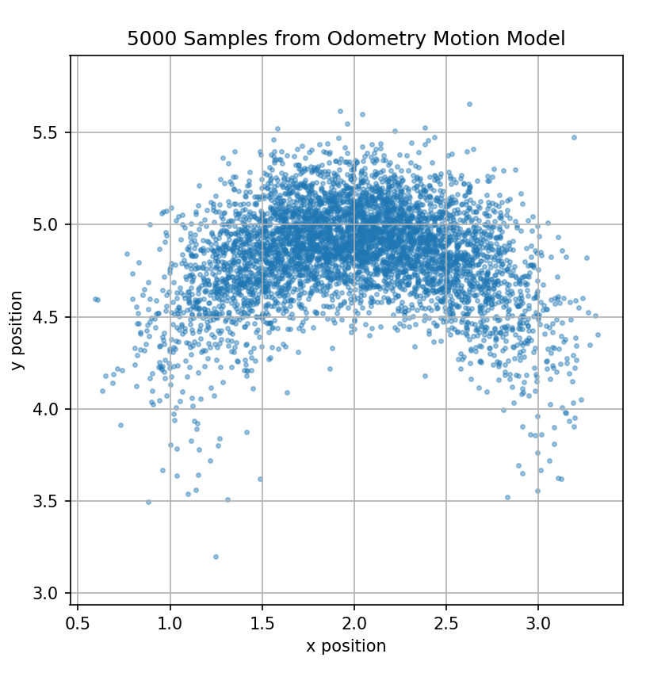

# Hw7

## E2.2

### (i)

2 steering commands. One command moves the robot along a semicircular arc to the goal position, and the second command rotates the robot in place by \(180^\circ\) to correct the heading.

A single command is not enough because one constant steering command produces either a straight line, an in-place rotation, or one circular arc, none of which can achieve the required sideways displacement while ending with the same heading.

### (ii)

The first command is a semicircular arc. Since the required horizontal displacement is \(0.5\text{ m}\),

\[
2R = 0.5
\]

so

\[
R = 0.25\text{ m}.
\]

Therefore the trajectory length is

\[
d = \pi R = \pi(0.25)=0.25\pi \text{ m}.
\]

### (iii)

With arbitrary many steering commands, the shortest trajectory is to rotate in place, drive straight to the goal, and then rotate in place back to the desired heading.

Let \(\Omega>0\) be the wheel angular speed, \(b\) be the distance between the wheels, and \(r\) be the wheel radius.

1. Rotate clockwise by \(90^\circ\):

\[
(v_l,v_r,t)=\left(\Omega,-\Omega,\frac{\pi b}{4r\Omega}\right)
\]

2. Drive straight \(0.5\text{ m}\):

\[
(v_l,v_r,t)=\left(\Omega,\Omega,\frac{0.5}{r\Omega}\right)
\]

3. Rotate counterclockwise by \(90^\circ\):

\[
(v_l,v_r,t)=\left(-\Omega,\Omega,\frac{\pi b}{4r\Omega}\right)
\]

### (iv)

The two in-place rotations do not contribute to the trajectory length of the robot center. Therefore the shortest trajectory length is only the straight segment:

\[
d=0.5\text{ m}.
\]

## E2.6

### (ii)

The resulting poses will form a distribution instead of a single fixed pose, because each evaluation samples different Gaussian noise values. The samples should be centered around the nominal odometry prediction. If the sampled noise values are fixed, then the same pose will be obtained every time.

### (iii)


## E3.1

### (i)

Yes, in general. With three known landmarks and exact ranges from the robot to each landmark, we can draw three circles centered at the landmarks. The robot position is the common intersection point of the three circles. This is known as trilateration.

However, this assumes the landmarks are in a non-degenerate configuration. For example, if the geometry is degenerate, the solution may not be unique.

### (ii)

No. Even if the landmark position is known in the world frame, one exact range and bearing measurement is not sufficient to determine the robot's \((x,y)\) position if the robot heading \(\theta\) is unknown.

The range places the robot on a circle around the landmark. The bearing is measured relative to the robot's local frame, so without knowing the robot's heading, the bearing cannot be converted into a unique global direction. Therefore, infinitely many robot positions on the circle may be possible.

### (iii)

With only one exact range and one exact bearing to one landmark, it is not sufficient to determine the full robot pose \((x,y,\theta)\). There are three unknowns, but only two independent measurements.

With one exact range and two exact bearings with respect to two known landmarks, it is generally sufficient to determine \((x,y,\theta)\), assuming the landmarks are distinct and the geometry is non-degenerate. The range constrains the robot position to a circle, and the two bearing measurements provide enough angular information to determine the position and then recover the heading.

## 3.2

### (i)

The measurement model is
\[
d_i \sim \mathcal{N}(\|m-x_i\|,\sigma_i^2).
\]

For campus \(m_0=(10,8)^T\),
\[
h_0(m_0)=\sqrt{20}\approx 4.472,\qquad
h_1(m_0)=\sqrt{26}\approx 5.099.
\]
Thus,
\[
J(m_0)=\frac{(3.9-4.472)^2}{1}
+\frac{(4.5-5.099)^2}{1.5}
\approx 0.566.
\]

For home \(m_1=(6,3)^T\),
\[
h_0(m_1)=\sqrt{37}\approx 6.083,\qquad
h_1(m_1)=\sqrt{17}\approx 4.123.
\]
Thus,
\[
J(m_1)=\frac{(3.9-6.083)^2}{1}
+\frac{(4.5-4.123)^2}{1.5}
\approx 4.860.
\]

Since \(J(m_0)<J(m_1)\), the measurements are more likely if the friend is at campus. Therefore, the friend is more likely to be at campus.

## E3.4

z0 likelihood = 63.66197723675814
z1 likelihood = 1.4621446752770663e-73
z2 likelihood = 8.615711720739453
z3 likelihood = 2.606648564089251e-28

## Code 

```python
import numpy as np
import scipy.stats
import matplotlib.pyplot as plt

# The following function gives a sample distributed according to N(mu,sigma^2), var = sigma^2
# and you can use it directly below
def box_muller(mu, var):
    u1 = np.random.rand(1)
    u2 = np.random.rand(1)
    x = np.cos(2*np.pi*u1)*np.sqrt(-2*np.log(u2))
    # this must give you the sample according to N(mu,sigma^2=var)
    y = mu + np.sqrt(var)*x
    return y


## Exercise E2.6
def sample_motion_model(x_t, u_t_plus_1, alpha):
    # x_t is your initial pose (position and orientation)
    # u_t_plus_1 is a vector of three components,
    #       that correspond to the sequence of commands matching the odometry reading
    # alpha are the parameters in the odometry motion model
    
    # extract data from list
    x = x_t[0]
    y = x_t[1]
    theta = x_t[2]

    delta_rot1 = u_t_plus_1[0]
    delta_rot2 = u_t_plus_1[1]
    delta_trans = u_t_plus_1[2]

    alpha1 = alpha[0]
    alpha2 = alpha[1]
    alpha3 = alpha[2]
    alpha4 = alpha[3]

    # noise variances from the formula
    var_rot1 = alpha1 * delta_rot1**2 + alpha2 * delta_trans**2
    var_trans = alpha3 * delta_trans**2 + alpha4 * delta_rot1**2 + alpha4 * delta_rot2**2
    var_rot2 = alpha1 * delta_rot2**2 + alpha2 * delta_trans**2

    # sample zero-mean Gaussian noise
    noise_rot1 = float(box_muller(0, var_rot1))
    noise_trans = float(box_muller(0, var_trans))
    noise_rot2 = float(box_muller(0, var_rot2))

    # noisy odometry
    delta_rot1_hat = delta_rot1 - noise_rot1
    delta_trans_hat = delta_trans - noise_trans
    delta_rot2_hat = delta_rot2 - noise_rot2

    # new pose
    x_new = x + delta_trans_hat * np.cos(theta + delta_rot1_hat)
    y_new = y + delta_trans_hat * np.sin(theta + delta_rot1_hat)
    theta_new = theta + delta_rot1_hat + delta_rot2_hat

    x_t_plus_1 = [x_new, y_new, theta_new]
    return x_t_plus_1


## Exercise E3.4
def landmark_sensor_model(z, x, l):
    # z is your range and bearing, x robot pose, l is the landmark
    
    ## get values
    
    pos_x = x[0]
    pos_y = x[1]
    pos_theta = x[2]

    mark_x = l[0]
    mark_y = l[1]

    # calculate true values
    
    dx = mark_x - pos_x
    dy = mark_y - pos_y

    expected_range = np.sqrt(dx**2 + dy**2)
    expected_bearing = np.atan2(dy, dx) - pos_theta
    expected_bearing = (expected_bearing + np.pi) % (2 * np.pi) - np.pi
    
    # set up model parameters
    
    sigma_r_squared = 0.25
    sigma_theta_squared = 0.01
    
    # calculate probability
    
    range_error = z[0] - expected_range
    bearing_error = (z[1] - expected_bearing+ np.pi) % (2 * np.pi) - np.pi
    p_range = scipy.stats.norm.pdf(range_error,0,sigma_r_squared)
    p_bearing = scipy.stats.norm.pdf(bearing_error,0,sigma_theta_squared)
    
    #calculate likelihood
    
    likelihood = p_range*p_bearing
    
    return likelihood


if __name__ == '__main__':
    # plot scatter plot of motion model with 5000 positions
    # from the conditions in the problem statement
    x_t = [2, 4, 0]
    u_t_plus_1 = [np.pi / 2, 0, 1]
    alpha = [0.1, 0.1, 0.01, 0.01]

    samples = []

    for _ in range(5000):
        samples.append(sample_motion_model(x_t, u_t_plus_1, alpha))

    samples = np.array(samples)

    plt.figure(figsize=(6, 6))
    plt.scatter(samples[:, 0], samples[:, 1], s=6, alpha=0.4)
    plt.xlabel("x position")
    plt.ylabel("y position")
    plt.title("5000 Samples from Odometry Motion Model")
    plt.axis("equal")
    plt.grid(True)
    plt.show()

    x = np.array([2, 3, np.pi / 4])
    l = np.array([2, 8])

    z0 = np.array([5.0, np.pi / 4])
    z1 = np.array([5.0, 0.6])
    z2 = np.array([4.5, np.pi / 4])
    z3 = np.array([5.5, 0.9])

    measurements = [z0, z1, z2, z3]

    for i, z in enumerate(measurements):
        likelihood = landmark_sensor_model(z, x, l)
        print(f"z{i} likelihood = {likelihood}")
```