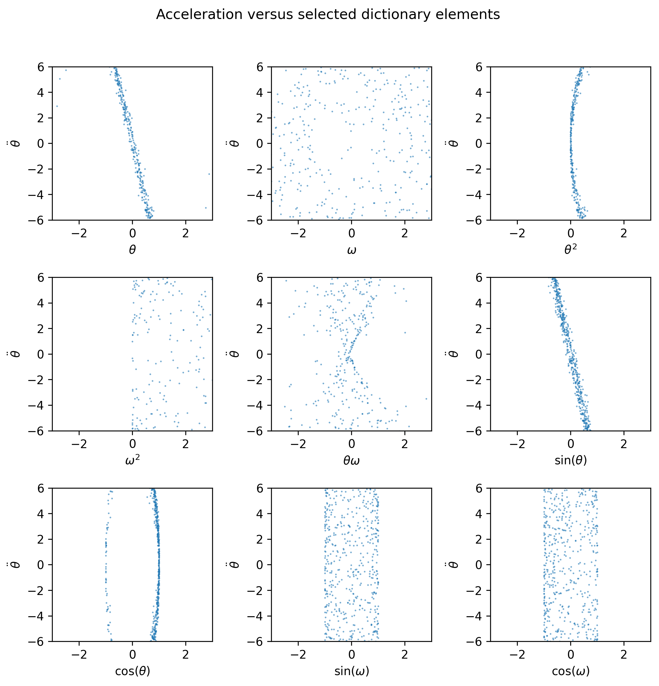
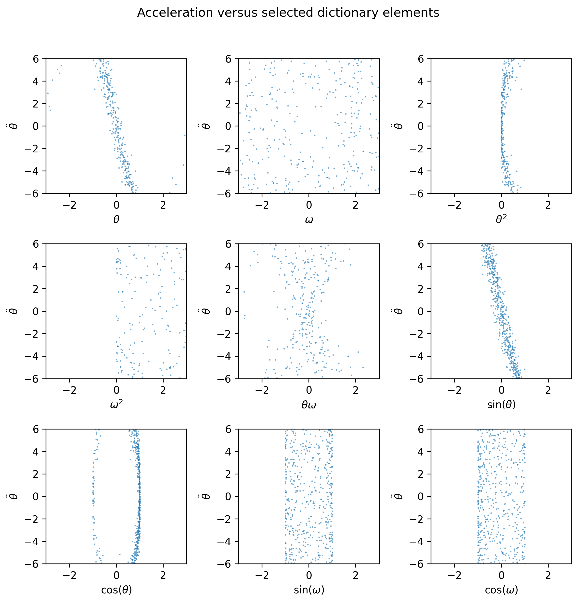
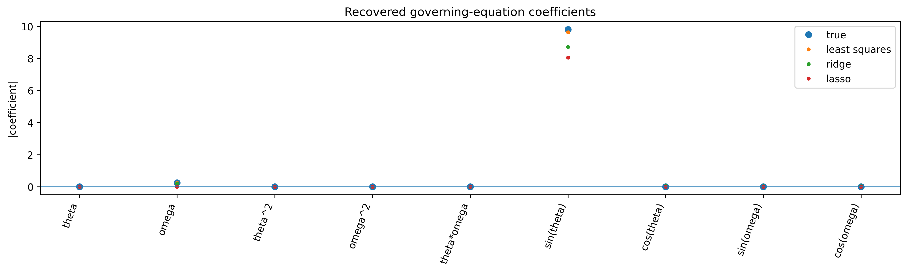
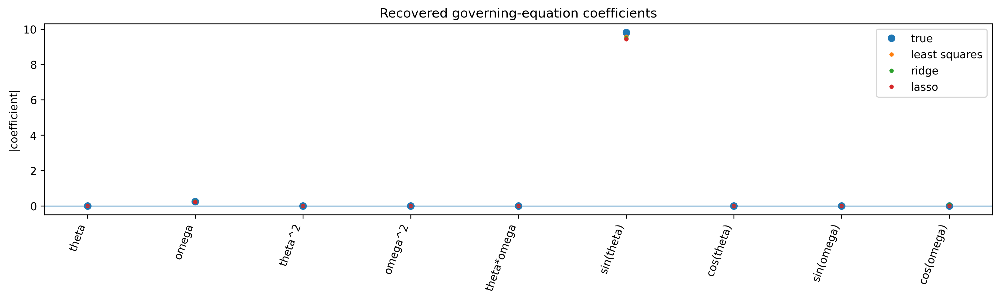

# HW4 - codes

## Analytical part

```python
import numpy as np

x = np.array([0.27093981, 0.18046082, 0.36049533, 0.1971442,
              0.46258231, 0.52384941, 0.49240247, 0.12699269])

y = np.array([2.83085451, 6.18744823, 0.94532684, -2.52021475,
              3.67784773, 0.78365838, 3.15266217, 1.96372897])

x_bar = np.mean(x)
y_bar = np.mean(y)

numerator = np.sum((x - x_bar) * (y - y_bar))
denominator_base = np.sum((x - x_bar) ** 2)

print("x_bar =", x_bar)
print("y_bar =", y_bar)
print("numerator =", numerator)
print("denominator_base =", denominator_base)

for lam in [0, 1]:
    theta = numerator / (denominator_base + lam)
    theta0 = y_bar - theta * x_bar

    print("\nlambda =", lam)
    print("theta =", theta)
    print("theta0 =", theta0)

x_test = np.array([0.63446731, 0.40335105])
y_test = np.array([3.10018735, 1.42556588])

models = {
    0: {"theta": 0.46410425, "theta0": 1.97596765},
    1: {"theta": 0.06644624, "theta0": 2.10594550}
}

for lam, params in models.items():
    theta = params["theta"]
    theta0 = params["theta0"]

    y_pred = theta * x_test + theta0
    squared_errors = (y_test - y_pred) ** 2
    mse = np.mean(squared_errors)

    print("lambda =", lam)
    print("y_pred =", y_pred)
    print("squared_errors =", squared_errors)
    print("MSE =", mse)
    print()
```

Result:

```text
x_bar = 0.32685838
y_bar = 2.1276640099999997
numerator = 0.07754900554486965
denominator_base = 0.16709393579138337

lambda = 0
theta = 0.46410424877231643
theta0 = 1.9759676470951635

lambda = 1
theta = 0.06644624152920921
theta0 = 2.1059454991366735

lambda = 0
y_pred = [2.27042663 2.16316459]
squared_errors = [0.68850286 0.54405185]
MSE = 0.6162773562787867

lambda = 1
y_pred = [2.14810347 2.13274666]
squared_errors = [0.90646372 0.50010466]
MSE = 0.7032841882653876
```

# Programming Questions

## 1.

### (a)

The dictionary of candidate terms was expanded to include:

- theta
- omega
- theta^2
- omega^2
- theta * omega
- sin(theta)
- cos(theta)
- sin(omega)
- cos(omega)

These terms were used as the feature library for regression and sparse identification of the pendulum governing equation.

---

### (b)





The plots for sin(theta) and omega show the clearest relationships with angular acceleration, matching the true pendulum equation of motion. The remaining dictionary terms show weaker or nonlinear relationships because they are not part of the governing equation. With added noise, the scatter becomes more diffuse.

---

### (c)






Least squares, ridge, and lasso all recover the dominant omega and sin(theta) terms. Least squares produces more spurious coefficients, especially with noisy data. Ridge shrinks coefficients, while lasso produces the sparsest solution by driving many irrelevant coefficients close to zero.

---

## 2.

```python
import pandas as pd
import sklearn.model_selection
import sklearn.metrics
from sklearn import linear_model
from sklearn import svm


def classification_movies(r, C=1.0, movie_title=None):
    df = pd.read_csv("./movies_clean.csv")

    classification_target = "profitable"
    all_covariates = [
        "budget", "popularity", "runtime", "vote_count", "vote_average",
        "Action", "Adventure", "Fantasy", "Science Fiction", "Crime",
        "Drama", "Thriller", "Animation", "Family", "Western", "Comedy",
        "Romance", "Horror", "Mystery", "War", "History", "Music",
        "Documentary", "TV Movie", "Foreign"
    ]

    X = df[all_covariates]
    y = df[classification_target]

    x_train, x_test, y_train, y_test = sklearn.model_selection.train_test_split(
        X, y, random_state=0
    )

    if r == 1:
        reg = linear_model.LogisticRegression(C=C, max_iter=100000)
    elif r == 2:
        reg = svm.SVC(C=C)
    else:
        print("r should be 1 or 2")
        return 0

    reg.fit(x_train, y_train)

    if movie_title is not None and r == 1:
        movie = df[df["title"] == movie_title]

        if len(movie) == 0:
            print("Movie not found.")
        else:
            movie_X = movie[all_covariates]
            prob = reg.predict_proba(movie_X)[0, 1]

            print("Movie:", movie_title)
            print("Predicted probability of profitability:", prob)
            print("Actual profitable label:", movie[classification_target].iloc[0])

    y_predict = reg.predict(x_test)

    return sklearn.metrics.accuracy_score(
        y_true=y_test,
        y_pred=y_predict
    )


print("Logistic Regression C=1:", classification_movies(1, C=1.0))
print("SVM C=1:", classification_movies(2, C=1.0))

print("Logistic Regression C=0.1:", classification_movies(1, C=0.1))
print("Logistic Regression C=10:", classification_movies(1, C=10))

print("SVM C=0.1:", classification_movies(2, C=0.1))
print("SVM C=10:", classification_movies(2, C=10))

print("\nAvatar:")
classification_movies(1, C=1.0, movie_title="Avatar")

print("\nFood, Inc.:")
classification_movies(1, C=1.0, movie_title="Food, Inc.")
```

Result:

```text

Logistic Regression C=1: 0.8352272727272727
SVM C=1: 0.8039772727272727
Logistic Regression C=0.1: 0.8238636363636364
Logistic Regression C=10: 0.8295454545454546
SVM C=0.1: 0.75
SVM C=10: 0.8323863636363636

Avatar:
Movie: Avatar
Predicted probability of profitability: 0.9928348749693117
Actual profitable label: 1

Food, Inc.:
Movie: Food, Inc.
Predicted probability of profitability: 0.7024289573338109
Actual profitable label: 0

```

### (a)

Logistic Regression C=1: 0.8352  
SVM C=1: 0.8040  

---

### (b)

Logistic Regression performs better because it has higher test accuracy.

---

### (c)

C=0.1:
- Logistic Regression: 0.8239
- SVM: 0.7500

C=10:
- Logistic Regression: 0.8295
- SVM: 0.8324

Increasing C weakens regularization because C = 1 / λ. For SVM, increasing C improved the test accuracy significantly. For logistic regression, changing C did not improve the result much, and C=1 gave the best score among the tested values.

---

### (d)

For Avatar, the logistic regression model predicts a profitability probability of 0.9928. The actual profitable label is 1, so the model prediction agrees with the database.

---

### (e)

For Food, Inc., the logistic regression model predicts a profitability probability of 0.7024. However, the actual profitable label in the database is 0, so the model prediction does not agree with the database label. This shows that the model can still make a prediction using the remaining features, even when budget or revenue information is missing or unreliable.